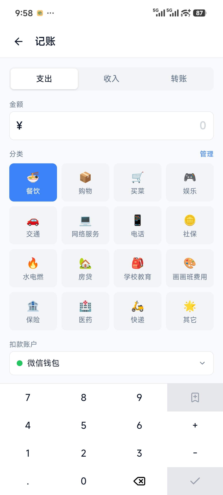
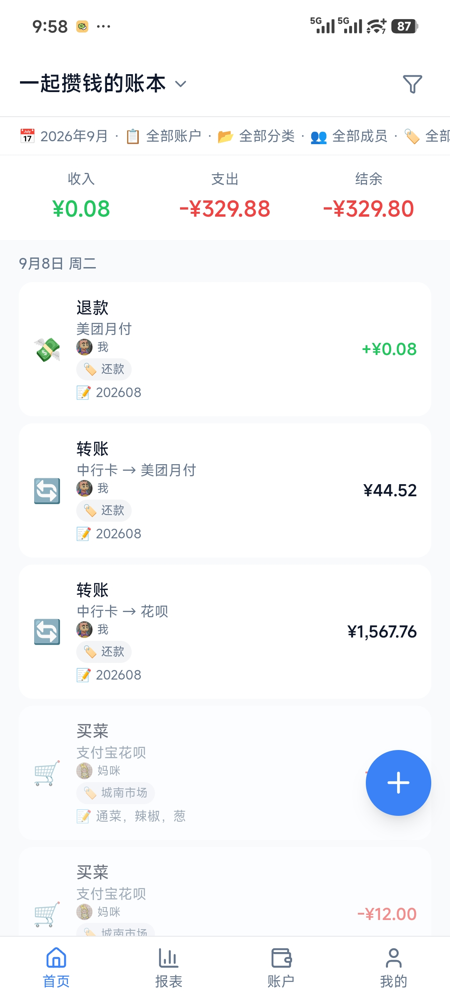
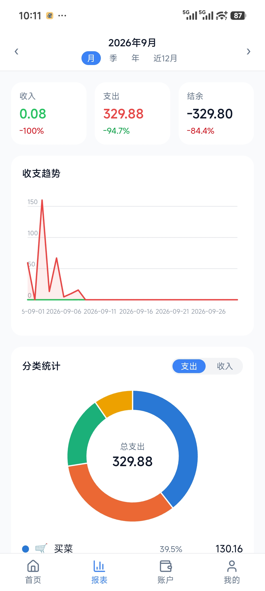
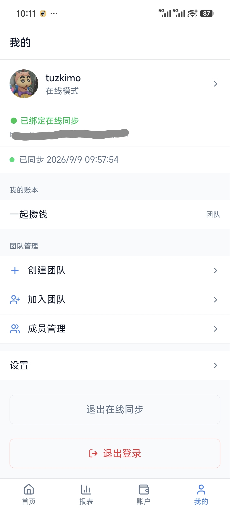

# 一起数钱（WeeCount）

离线优先、家庭/团队协同的资产级记账 App。

[](LICENSE)
[](https://github.com/tuzkimo/wee-count/actions/workflows/release-android.yml)
[](https://github.com/tuzkimo/wee-count/actions/workflows/deploy-backend.yml)

## 截图

| 记账 | 流水 | 报表 | 我的 |
|:---:|:---:|:---:|:---:|
|  |  |  |  |

## 功能特性

- **离线优先**：数据存本机 SQLite，无网络完整可用；后端可选
- **资产级账户体系**：资产/负债双类型，信用卡额度与还款日，净资产汇总
- **记账闭环**：支出/收入/转账，自定义分类、多标签、备注、精确到分钟的时间
- **报表仪表盘**：收支趋势、分类占比、账户净资产曲线，月/季/年/近 12 月切换，自绘 SVG 零图表库依赖
- **团队共享账本**：创建/加入团队（邀请码），成员管理与成员备注别名
- **多用户与同步**：本地多账户独立数据库；自托管后端后多设备同步（LWW 合并 + 服务端单调游标增量），服务下线自动降级重连
- **隐私**：本地模式数据不出设备；自托管时数据只在你自己的服务器

## 技术栈

| 层 | 技术 |
|------|------|
| 前端 | Vue 3 + TypeScript + Vite + Pinia + Tailwind CSS v4 |
| 客户端壳 | Tauri 2.0（Android 为主目标平台，桌面端仅开发调试） |
| 本地存储 | SQLite（`@tauri-apps/plugin-sql`） |
| 后端（可选） | Go + PostgreSQL + Redis |

## 快速开始（开发调试）

环境要求：Node 22+、Rust stable（Android 端另需 Android SDK/NDK 与 JDK 17）

```bash
npm ci
npm run dev                  # Vite dev server（http://localhost:1420，可先浏览器调试）
npm run tauri dev            # Tauri 桌面窗口（仅开发调试用）
npm run tauri android dev    # 编译并推送到已连接的 Android 设备
npm run test                 # 前端单元测试（vitest）
```

> gradle wrapper 默认走腾讯镜像（`src-tauri/gen/android/gradle/wrapper/gradle-wrapper.properties`），海外网络环境可改回 `https://services.gradle.org/...` 官方源。

## 自托管

App 开箱即本地模式，不部署后端也完整可用。需要多设备/家庭成员同步时，用 Docker Compose 一键拉起 API + PostgreSQL + Redis，再在 App「我的 → 在线同步」填入 API 地址即可。

完整步骤见 **[docs/SELF-HOSTING.md](docs/SELF-HOSTING.md)**。

## 文档

- [自托管部署指南](docs/SELF-HOSTING.md)
- [开发约定](AGENTS.md)

## License

[MIT](LICENSE)
